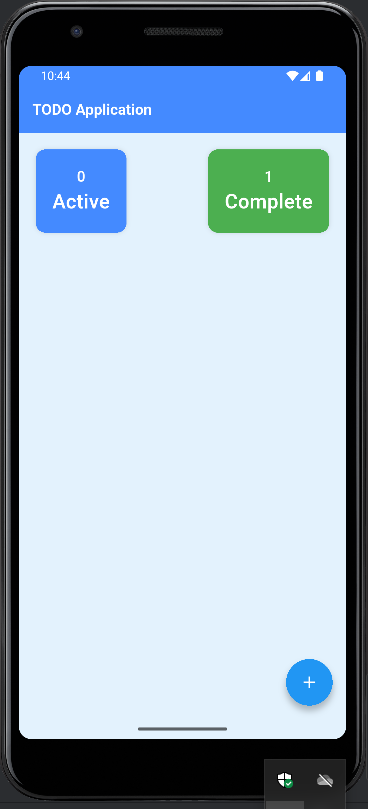
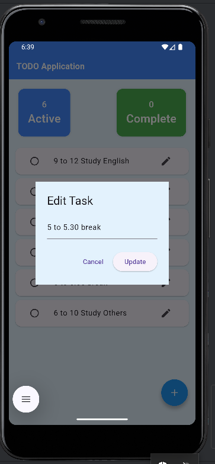
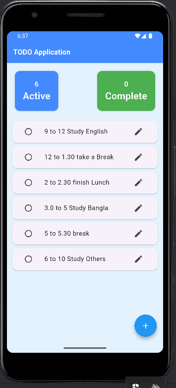
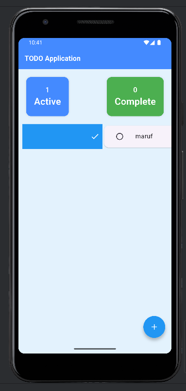
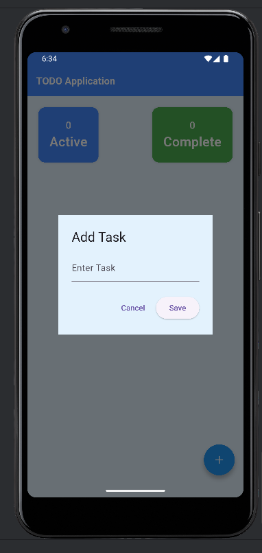
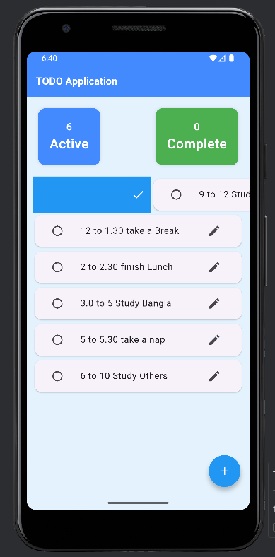
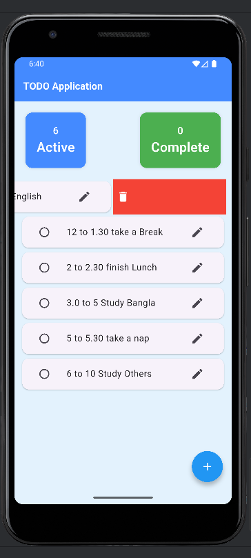
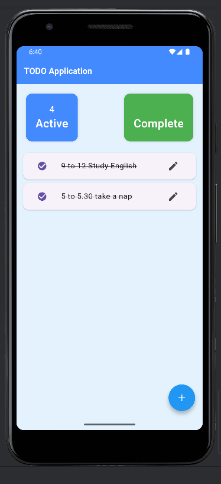

# todo

This is TODO application for track my daily tasks.

## To Do Application for used track daily tasks

```
    git remote add origin https://github.com/MarufMobin/Todo.git
    
    flutter pub get 
    flutter pub update
    flutter run
```

# There are the Application UI







